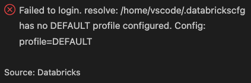

# Databricks Project Template (VS Code Dev Container)

This repository is a minimal template to help developers build Databricks projects using a VS Code Dev Container. It installs the databricks cli, the vscode Databricks extension, and demonstrates a Python packaging layout, a sample job, unit tests, and a `databricks.yml` bundle that can be used to deploy jobs/resources/wheel to Databricks.

## What this template provides

- A VS Code **Dev Container** preconfigured for Databricks development (Python tooling, Databricks CLI, `uv`, etc.).
- A sample **Python package** (`sample_package`) managed via `pyproject.toml` (Hatchling + `uv`) with a ready-to-build wheel.
- A Databricks **bundle configuration** (`databricks.yml`) wired to:
  - deploy the wheel artifact to your workspace, and  
  - run it as a Databricks job that references a python wheel.

I've tested this out on Azure Databricks premium workspace as well as free edition. It should work fine on AWS/GCP as well.  

The asset bundle is configured to use *serverless* compute in the databricks workspace. This took me a while to figure
out, some of this stuff is pretty new and not easy to find in the ref docs.

Use this template as a starting point for building and deploying your Databricks workloads while developing in a reproducible dev container. Why use a dev container? Because once you use containers you'll never go back. 

I did use the chatbot to generate some of the boilerplate in this doc. I've reviewed it all, but please let me know if you encounter any fun hallucinations or alternative facts.  

---

## Project Layout

```text
.
├─ notebooks/                  # Optional exploratory notebooks
├─ src/
│  └─ sample_package/          # Python package (rename for your project)
│      ├─ __init__.py
│      ├─ jobs/                # Job entrypoints (python_wheel_task)
│      │   └─ sample_job.py
│      ├─ pipelines/           # Lakehouse/LakeFlow/DLT pipeline logic
│      └─ utils/               # Shared helpers
|          └─ sample_utils.py  # Package code
├─ tests/
│  └─ unit/                    # Unit tests (pytest)
│      └─ test_math_utils.py   # Example tests
├─ databricks.yml              # Databricks Bundle: jobs, pipelines, targets
├─ pyproject.toml              # uv + packaging config
├─ uv.lock                     # uv lockfile
├─ README.md
└─ .gitignore
```

Key files and directories you'll find here:

- `pyproject.toml` - Project metadata, dependencies, and scripts (build/test). It lists runtime requirements and developer tooling (pytest, black, flake8, etc.).
- `databricks.yml` - Databricks bundle configuration (jobs, artifacts, targets). Edit this file to match your Databricks workspace(s) and artifact locations.
- `.devcontainer/` - VS Code dev container definition (includes `setup_env.sh` - creates an isolated Python virtual environment in the container and installs required packages).
- `src/sample_package/` - The Python package for the project. Includes a sample job entry point `jobs/sample_job.py`.
- `notebooks/` - Example notebooks for experimentation.
- `tests/` - Unit and integration tests (e.g., `tests/unit/test_sample_utils.py`).

The pyproject.toml and uv.lock files will be generated on first build of the container. 

---

## Setup

### 0. Prerequisites 
Ensure the following are installed on your host:
   - Docker
   - VS Code + Dev Containers (Microsoft) extension

You'll need access to a Databricks workspace with serverless compute enabled. If you want to use a cluster you'll need to modify the databricks.yml (there's a commented out section in there that tells you what to do). 

---

### 1. Clone this repo
Feel free to make suggestions for improvements in the form of comments or a pull request. 

---

### 2. Persisting credentials across dev-container rebuilds
> **Note:** this step is 'kind of' optional, but i encourage you to read on... 

You'll notice that `devcontainer.json` bind-mounts a few files and directories from your host `$HOME` into the container:

```jsonc
"mounts": [
  "source=${localEnv:HOME}/.gitconfig,target=/home/vscode/.gitconfig,type=bind",
  "source=${localEnv:HOME}/.ssh,target=/home/vscode/.ssh,type=bind",
  "source=${localEnv:HOME}/.databrickscfg,target=/home/vscode/.databrickscfg,type=bind,consistency=cached",
  "source=${localEnv:HOME}/.databricks,target=/home/vscode/.databricks,type=bind,consistency=cached"
]
```
Dev containers are disposable by design: every rebuild gives you a fresh filesystem. That's great for reproducibility, but annoying for anything you don't want to re-enter every time (SSH keys, Databricks auth, Git identity, etc.).

> **Note**: you can always comment out the mounts section in the `.devcontainer.json` file if it's causing you too much stress. Or you can just leave them in there. If the local paths on your os host don't exist the container will just complain on build and ignore them -> and then default to locations inside the container (but you'll have to reconfigure git (name and email deets) and the databricks profiles/creds after every container rebuild and i hate that.)

For the git mounts to work, you just need to install git in on your local OS if it's not there already. The mounts will show up as folders inside the container once it builds, and any git operation will read creds from those external folders. 

For the Databricks mounts: the Databricks CLI is only installed inside the container, not on the host. You'll need to create a stub in the home directory of your local host os like so: 

- `mkdir -p "$HOME/.databricks"`
- `touch "$HOME/.databrickscfg"`

This gives you:
- ~/.databrickscfg – an empty config file that the Databricks CLI inside the container will populate with profiles.
- ~/.databricks/ – a directory that will be used for token/cache files when you authenticate from inside the container.

If you're on Windows and Docker Desktop is using WSL2, you'd run the previous commands in the WSL distro instead. 

By mounting these host paths into the container:

- Credentials and identity persist across rebuilds.
- Credentials stay on your host filesystem; they are not copied into the container image and not checked into source control.
- Git, SSH, and Databricks CLI inside the container behave exactly like they do on your host, using the same config and keys.
- ~/.gitconfig gives Git inside the container the same name, email, and settings as on your host.
- ~/.ssh provides your existing SSH keys and known_hosts, so you can pull from/push to private repos without re-creating keys.
- ~/.databrickscfg and ~/.databricks reuse your existing Databricks CLI profiles and auth tokens, so you don't have to log in again after every container rebuild.

#### Security note

These mounts give the container access to sensitive files in your home directory (`~/.ssh`, `~/.databrickscfg`, `~/.databricks`). Only use this setup with dev containers and extensions you trust. If you need stricter isolation, consider:

- Mounting a dedicated SSH directory (e.g. `~/.ssh-databricks`), or  
- Using separate, project-specific Databricks profiles/keys stored in a different directory and mounting only that.

---

### 3. Modify `databricks.yml` to point to your databricks workspace
In the `databricks.yml`, update this line:
```python
    workspace:
      # The host is the URL for the Databricks workspace where this target is
      # deployed. This should be a valid, accessible workspace URL.
      host: << your databricks workspace url goes here, e.g. https://adb- ... azuredatabricks.net >>
```

---

### 4. Run the Dev Container

1. Open this repository in VS Code.
2. Choose "Reopen in Container" when the prompt appears.
3. The dev container runs `setup_env.sh` which:
   - Creates a minimal `pyproject.toml` if missing
   - Creates `.venv` and syncs packages via `uv sync` 
   - Installs `databricks-connect`

---

### 5. Configure OAuth authentication to the Databricks workspace

The first time the container builds, you'll see this error: 



It's simply indicating that you have not set up any means of authentication from vscode to your Databricks workspace. You'll need to go through this process only once if you've opted to follow the instructions in step 2 (Persisting credentials across dev-container rebuilds). If not you'll need to do it every time the container rebuilds. 

Run this in the vscode terminal: 

`databricks auth login --host https://<your-workspace-url> --profile DEFAULT`

A browser window will open up somewhere asking for your credentials, and then you're done. 

You can accomplish the same thing via the Databricks extension (installed by the container). Just click on 'Login to Databricks' and you'll be guided through the steps. 


While you're there, you might have to configure some compute. Set it to serverless if available, otherwise select a cluster and go back and read Step 0. 


---

### 6. Deploy the asset bundle

At this point you should be good to deploy the asset bundle to the databricks workspace. `databricks.yml` will build the wheel using uv. The wheel is then deployed to the workspace along with the other project files. Run all of these commands from a terminal in the vscode container. 

First though, build the wheel. This is not strictly necessary, but avoids a validation warning for the next step. After doing this once, you won't have to do it again: 

`uv build --wheel`

Now validate the bundle: 

`databricks bundle validate`

Now deploy the bundle: 

`databricks bundle deploy`

Now, if you're feeling brave, run the sample job: 

`databricks bundle run sample-job`

If all went well, you should see: 

>Job ran successfully, 2 + 3 = 5

You can run the local unit tests like so: 

`uv run pytest`

...or use the test runner extension in vscode. 

---

# Notes

You can set up the container to be its own spark cluster. You'd need to install the spark runtime, and delta lake. This config is fantastic for unit testing when you don't want to wait for clusters to spin up on the remote databricks workspace, not to mention it lets you save your hard earned scrilla. I've tested that out too and it works well. 

---

## License

This template is released into the public domain under [The Unlicense](./LICENSE).

You can copy, modify, use, and redistribute it for any purpose, with no attribution required.

---

Suggestions? Open an issue or add a PR with your improvements.


